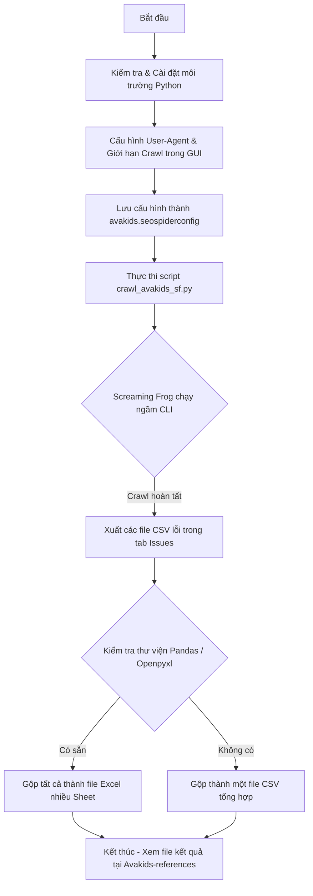

# Hướng dẫn chạy ngầm (Headless) Screaming Frog cho Site Avakids

Tài liệu này tổng hợp lại **Prompt yêu cầu** và **quy trình các bước thực hiện** để cấu hình và chạy ngầm (headless mode) công cụ Screaming Frog SEO Spider đối với website `https://www.avakids.com`, xuất báo cáo lỗi sang file tổng hợp định dạng Excel/CSV.

---

## 1. Prompt kích hoạt/yêu cầu AI tạo Script

Dưới đây là prompt mẫu đã được sử dụng để định hình script tự động hóa chạy ngầm Screaming Frog:

```markdown
Tôi đang dùng Screaming Frog bản 19.8 (đã kích hoạt bản quyền) trên hệ điều hành Windows.
Hãy viết giúp tôi một file script Python tên là crawl_avakids_sf.py nằm trong thư mục Avakids-scripts.

Yêu cầu chi tiết của script:
1. Sử dụng thư viện `subprocess` của Python để kích hoạt ngầm (headless mode) Screaming Frog bằng dòng lệnh (CLI).
2. Ra lệnh crawl trang web: https://www.avakids.com
3. Nếu có file cấu hình `avakids.seospiderconfig` trong cùng thư mục, tự động load cấu hình này để áp dụng (ví dụ: đổi User-Agent thành Googlebot/Chrome, giới hạn tốc độ crawl để tránh bị chặn).
4. Thực hiện xuất toàn bộ lỗi ở tab Issues ra thư mục đầu ra `Avakids-references/issues_reports/`.
   - Dùng tham số `--export-tabs "Issues"` (hoặc fallback sang `--bulk-export "Issues:All"` nếu phiên bản SF yêu cầu định dạng khác).
5. Sau khi crawl hoàn tất, tự động quét thư mục báo cáo:
   - Nếu máy có cài `pandas` và `openpyxl`, tự động gộp tất cả các file CSV lỗi thành các sheet tương ứng trong một file Excel duy nhất tên là `avakids_issues_summary.xlsx` (chú ý rút gọn tên sheet dưới 31 ký tự).
   - Nếu không có các thư viện trên, fallback gộp thành một file CSV duy nhất `avakids_issues_summary.csv` kèm phân vùng rõ ràng để dễ đọc.
```

---

## 2. Quy trình các bước thực hiện thực tế

Quy trình tự động hóa được thực thi qua các bước cụ thể như sau:



### Bước 1: Chuẩn bị môi trường Python
Để chạy script và xuất file Excel đa tiện ích, mở Terminal (PowerShell/Cmd) và cài đặt các thư viện hỗ trợ:
```bash
pip install pandas openpyxl
```

### Bước 2: Cấu hình file cấu hình dự án (`.seospiderconfig`)
Do các website TMĐT lớn như Avakids thường chặn các request bot mặc định, cần giả lập User-Agent là trình duyệt thật hoặc Googlebot:
1. Mở phần mềm **Screaming Frog GUI** trên máy tính.
2. Vào **Configuration** -> **User-Agent** -> Đổi sang `Googlebot (Smartphone)` hoặc `Chrome`.
3. Vào **Configuration** -> **Speed** -> Điều chỉnh số lượng luồng (Max Threads) xuống thấp (ví dụ: `1.0` hoặc `2.0` URI/s) để tránh làm nghẽn server và bị block IP.
4. Chọn **File** -> **Save Configuration As...** -> Lưu file với tên `avakids.seospiderconfig` và đặt vào thư mục:
   `c:\Users\Quan Tran\Documents\GitHub\Quan-AI-Agent\Project-skills\04_Avakids\Avakids-scripts\`

### Bước 3: Chạy script tự động hóa
Mở PowerShell tại thư mục dự án và chạy dòng lệnh sau để khởi động quá trình crawl ngầm:
```powershell
python "c:\Users\Quan Tran\Documents\GitHub\Quan-AI-Agent\Project-skills\04_Avakids\Avakids-scripts\crawl_avakids_sf.py"
```

### Bước 4: Kiểm tra kết quả báo cáo
Sau khi script chạy xong, bạn sẽ thấy kết quả tại thư mục [Avakids-references](file:///c:/Users/Quan%20Tran/Documents/GitHub/Quan-AI-Agent/Project-skills/04_Avakids/Avakids-references):
* Báo cáo tổng hợp: [avakids_issues_summary.xlsx](file:///c:/Users/Quan%20Tran/Documents/GitHub/Quan-AI-Agent/Project-skills/04_Avakids/Avakids-references/avakids_issues_summary.xlsx) (mỗi loại lỗi nằm ở một sheet).
* Chi tiết các lỗi riêng lẻ: Nằm trong thư mục con [issues_reports/](file:///c:/Users/Quan%20Tran/Documents/GitHub/Quan-AI-Agent/Project-skills/04_Avakids/Avakids-references/issues_reports).

---

## 3. Câu lệnh CLI gốc chạy dưới nền

Dưới đây là câu lệnh CLI thực tế mà script Python tạo ra và chạy ngầm thông qua `subprocess` (dành cho trường hợp bạn muốn chạy trực tiếp bằng tay từ CMD/PowerShell):

```powershell
& "C:\Program Files\Screaming Frog SEO Spider\ScreamingFrogSEOSpiderCli.exe" `
  --crawl "https://www.avakids.com" `
  --headless `
  --config "c:\Users\Quan Tran\Documents\GitHub\Quan-AI-Agent\Project-skills\04_Avakids\Avakids-scripts\avakids.seospiderconfig" `
  --bulk-export "Issues:All" `
  --output-folder "c:\Users\Quan Tran\Documents\GitHub\Quan-AI-Agent\Project-skills\04_Avakids\Avakids-references"
```

> [!NOTE]
> * Tham số `--headless` giúp phần mềm chạy ngầm mà không cần bật giao diện GUI lên, tiết kiệm RAM và CPU.
> * Tham số `--bulk-export "Issues:All"` chỉ định Screaming Frog tự động xuất toàn bộ các danh sách lỗi có trong tab **Issues** ra thành các file CSV riêng lẻ.
> * **Giới hạn quét (Crawl Limit):** File cấu hình `avakids.seospiderconfig` hiện tại đã được cấu hình giới hạn tối đa **50.000 URL** (`Limit Crawl Total = 50000`). Khi quét đạt mốc này, chương trình sẽ tự động ngưng và tiến hành xuất báo cáo lỗi ngay lập tức.

